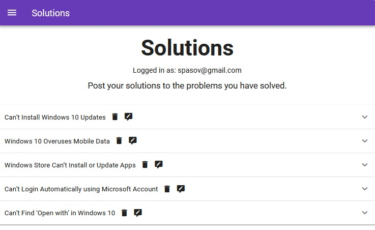

# ChatApp

An application for submitting problems and their solutions made with VueJS and Firebase. All data is stored in a database and the user has to sign in to post. A signed in user can read, post, delete and update solutons.

[Live app](https://solutions-fc133.web.app/)

## Built With

- [Vue.js](https://vuejs.org/) - The Progressive
  JavaScript Framework
- [Firebase](https://firebase.google.com/) - A comprehensive app development platform
- [Vuetify](https://vuetifyjs.com/en/) - The #1 component library for Vue.js

